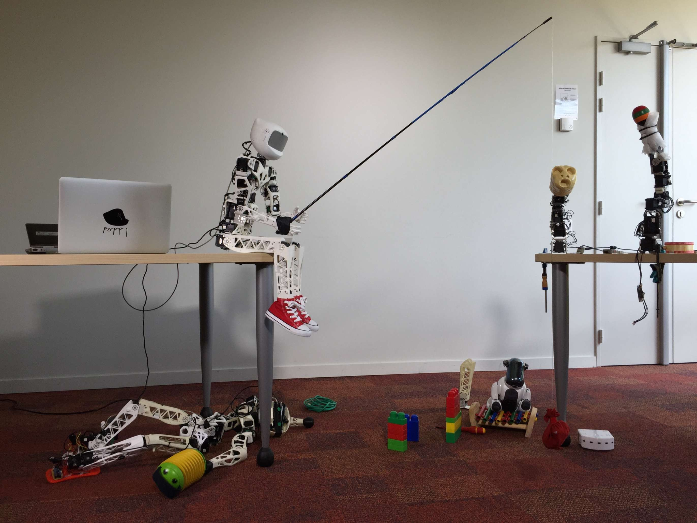

# Pypot: A Python lib for Dynamixel motors control #

Pypot is a library developed in the [inria FLOWERS](https://flowers.inria.fr/) team to make it easy and fast to control custom robots based on dynamixel motors. This framework provides different levels of abstraction corresponding to different types of use. More precisely, you can use pypot to:

* directly control robotis motors (both protocol v1 and v2 are supported) through a USB2serial device,
* define the structure of your particular robot and control it through high-level commands,
* define primitives and easily combine them to create complex behavior.

Pypot has been entirely written in Python to allow for fast development, easy deployment and quick scripting by non-necessary expert developers. It can also benefits from the scientific and machine learning libraries existing in Python. The serial communication is handled through the standard library and thus allows for rather high performance (10ms sensorimotor loop). It is crossed-platform and has been tested on Linux, Windows and Mac OS.

Pypot is also compatible with the [V-REP simulator](http://www.coppeliarobotics.com). This allows you to seamlessly switch from a real robot to its simulated equivalent without having to modify your code.

Finally, it has been developed to permit an easy and fast extension to other types of motors and sensors.

## The Poppy-project: open source ##

Pypot is part of the [Poppy project](http://www.poppy-project.org) aiming at developping robotic creations that are easy to build, customise, deploy, and share. It promotes open-source by sharing hardware, software, and web tools.

At the moment we already proposed a few Poppy Creatures:

* the [Poppy Humanoid](https://github.com/poppy-project/poppy-humanoid): a kid-size humanoid robot designed for biped locomotion and physical human-robot interaction,
* a [Poppy Ergo](https://www.poppy-project.org/project/mathematics-a-beautiful-elsewhere/): an art/science project where robotic creatures, endowed with algorithmic models of curiosity-driven learning and language formation, were hacked by moviemaker David Lynch,
* and a [Poppy Ergo Mini](https://github.com/poppy-project/poppy-ergo-mini) with low-cost [XL-320 robotis motors](http://support.robotis.com/en/product/dynamixel/xl-series/xl-320.htm) and modular 3D printed parts created using [OpenSCAD](https://github.com/openscad/openscad/).

All those creatures are based on a combination of standard dynamixel actuators, 3D printed parts and open-source electronics such as Arduino boards. Both the hardware (3D models, electronics...) and software can be freely used, modified and duplicated.

  License     |     Notebooks    |   Library      |
| ----------- | :-------------: | :-------------: |
| Name  | [Creatives Commons BY-SA](http://creativecommons.org/licenses/by-sa/4.0/)  |[GPL v3](http://www.gnu.org/licenses/gpl.html)  |
| Logo  |   |  |

Their development is tighly built upon the development of pypot.

Do not hesitate to [contact us](https://forum.poppy-project.org) if you want to get involved!

## Documentation ##

The full pypot documentation on a html format can be found [here](http://poppy-project.github.io/pypot/). It provides tutorials, examples and a complete API.

**The documentation is slowly moving toward [IPython Notebooks](http://ipython.org/notebook.html) are they are such a powerful tool for writing and sharing tutorials, experiments or pedalogical contents.**

**They can be found [here](https://github.com/poppy-project/pypot/tree/master/samples/notebooks#notebooks-everywhere) with a detailed explanation on how they can be used, installed, and modified.**

## Installation ##

Pypot is a library entirelly written in [Python](https://www.python.org). It is known to work with Python *2.7*, *3.4* and *pypy-2.5*. It is crossed platform and has been tested on Windows, Mac, Linux - yet specific usb to serial driver may be required depending on your system (see below). 

Pypot also requires the following python package:
* [pyserial](http://pyserial.sourceforge.net) 2.6 (or later)
* [numpy](http://www.numpy.org)

You can build and install pypot with the typically python way:

    cd pypot
    python setup.py install
    
or directly via [pip](https://pip.pypa.io/en/latest/index.html):

    pip install pypot

*Note: Linux users may have to run the commands above using sudo depending on their python installation*

    sudo python setup.py install
    or 
    sudo pip install pypot
    
*If you are new to Python and don't know how to install python packages please refer to [the official pip documentation](https://pip.pypa.io/en/latest/index.html) or see our tutorial on how you can [connect to one the notebook example](https://github.com/poppy-project/pypot/blob/master/samples/notebooks/readme.md#ipython-notebooks-everywhere).*

You will also have to install the driver for the USB2serial port. There are two devices that have been tested with pypot that could be used:

* USB2AX - this device is designed to manage TTL communication only
* USB2Dynamixel - this device can manage both TTL and RS485 communication.

For more details on the installation procedure, please refer to the [installation section](http://poppy-project.github.io/pypot/intro.html#installation) of the documentation.

## Roadmap ##

The roadmap of the project can be found [here](https://github.com/poppy-project/pypot/blob/master/roadmap.md).

